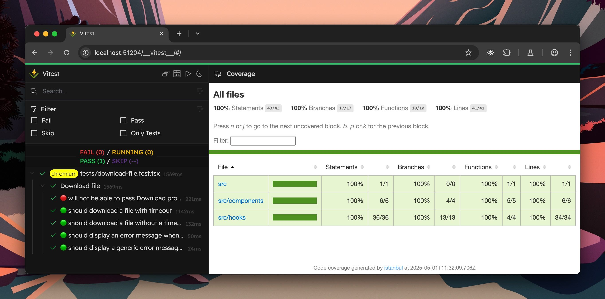

# NeverOff Demo - vitest-file-download

This repository demonstrates how to test file downloads using Vitest Browser mode.

https://github.com/user-attachments/assets/024c8290-0b7f-4369-b4b3-b3fe5a427f1c

And an example of `istambul` coverage report.

### Read the blog post [here](https://neveroff.dev/blog/testing-file-download-in-vitest-browser/).

## Getting started

1. Run `pnpm install`
2. Run `pnpm run dev` to see the downloads in action
3. Run `pnpm run test` to see the test running in Chromium, Gecko and WebKit browsers.

To show coverage run `npx vitest --browser.name chromium --coverage`, add `--ui` if you want to see the Vitest UI with details on runtime & coverage.
